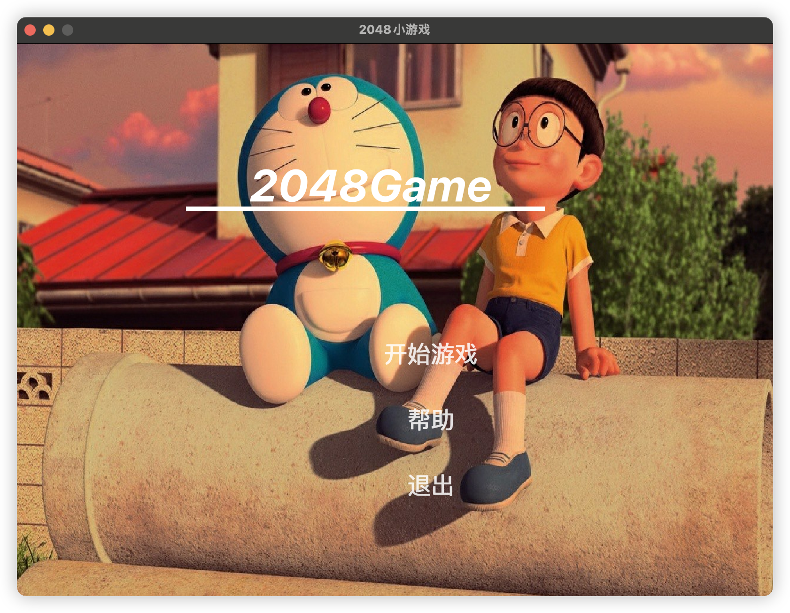
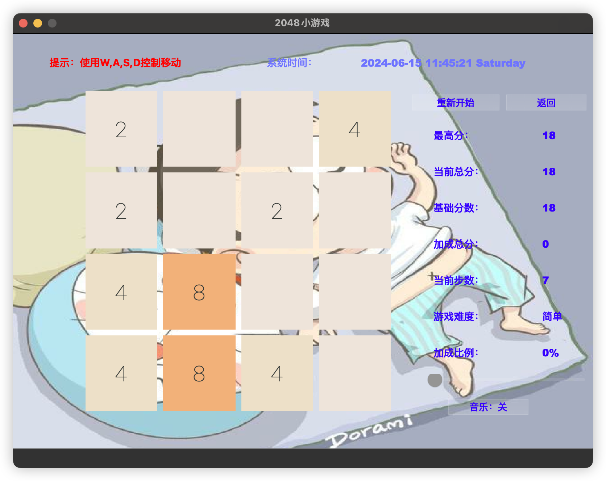

# 2048 Qt 游戏
---
## 简介
这是一个使用Qt框架编写的2048游戏。它提供了经典的2048游戏体验，具有平滑的动画和直观的用户界面。

## 特性

- **跨平台支持**：使用Qt框架，确保游戏可以在不同操作系统上运行。
- **用户界面**：简洁且响应式的设计，提供良好的用户体验。
- **输入支持**：游戏支持键盘。
- **分数追踪**：游戏包含动态分数显示和最高分记录。

## 快速开始
需下载 QT5.x 或者之后的版本。

QT 下载：https://www.qt.io/download

要运行游戏，请按照以下步骤操作：

```bash
git clone https://github.com/DevicesKenny/qt-2048.git
cd 2048-Qt
```

使用Qt Creator打开`2048-Qt.pro`文件，然后构建并运行项目。

## 游戏规则

使用键盘上的W、S、A、D来移动方块。两个相同数字的方块在碰撞时会合并。游戏的目标是在棋盘上创建一个数值为2048的方块。

## 运行效果

### 主界面



### 游戏界面



---


